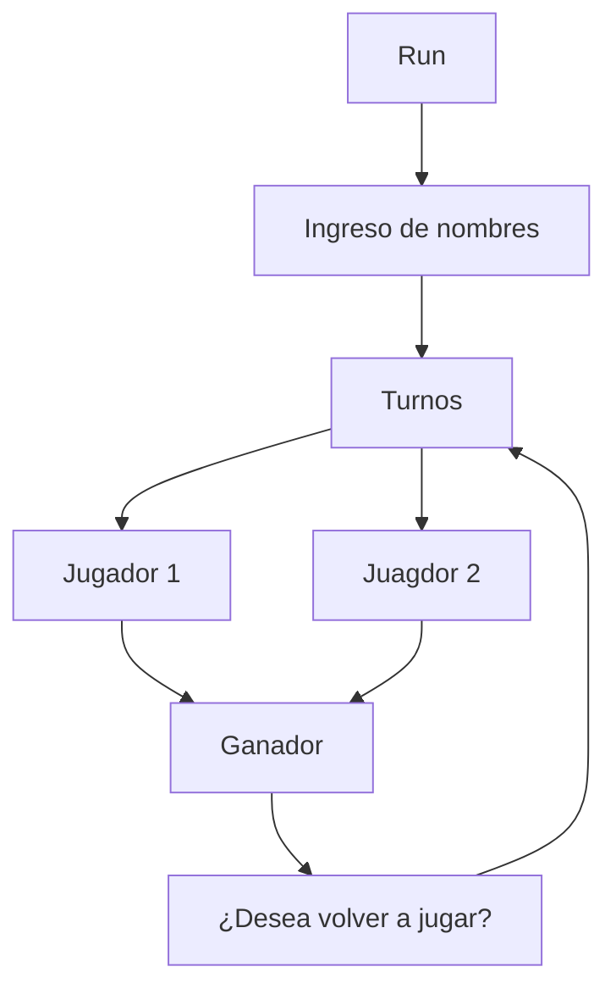

# Gravity-Connect4
Proyecto simple hecho en Java, basado en el clasico juego conecta 4, pero con la adicion de mecanicas de gravedad en sus bordes en un tablero de 6x6 cuadriculas.
## Descripción
Este proyecto es un juego de conecta 4, en el cual se puede jugar contra otro jugador, en un formato 1vs1 por turnos.



## Instalación
Para poder jugar este juego, se necesita tener instalado Java en su computadora.
## Uso
Una vez instalado Java en su computadora, necesita correr el archivo .jar que se encuentra en la carpeta dist. Para esto, puede hacerlo desde la terminal con el comando:
```bash 
java -jar "Integrativa.jar"
```
O puede hacerlo desde el explorador de archivos, haciendo doble click en el archivo .jar.

